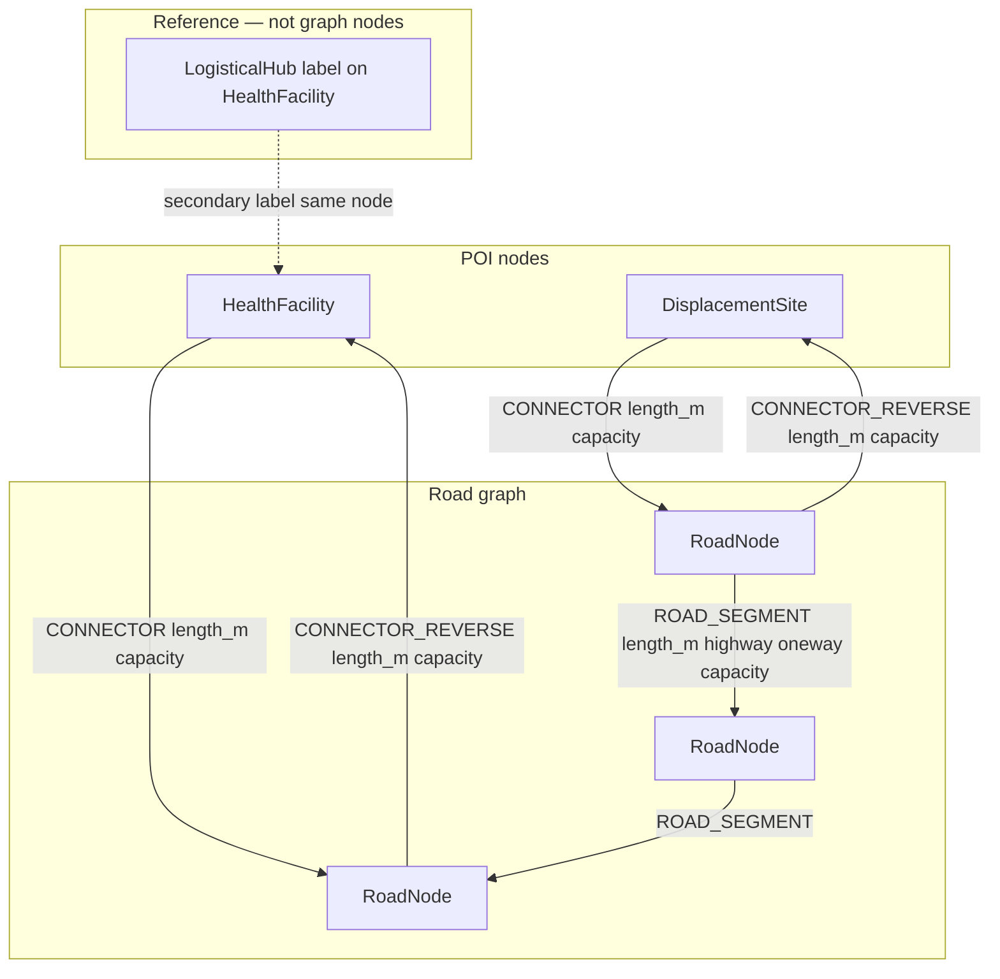

# Phase 2 — Graph Schema (Neo4j)

**Project:** South Sudan RDBMS vs Graph DB comparison  
**Date:** 2026-06-24  
**Status:** Complete — ready for Phase 3 import

Constraints/indexes: [`src/db/neo4j/constraints.cypher`](../src/db/neo4j/constraints.cypher)

---

## 1. Purpose

Property-graph model aligned with the PostgreSQL schema and the same processed datasets. Supports benchmark queries Q1–Q5 with native graph traversal for shortest-path and reachability workloads.

---

## 2. Graph model overview



| Element | Count | Notes |
|---------|-------|-------|
| `RoadNode` | 24,779 | OSMnx intersection/dead-end nodes |
| `HealthFacility` | 2,017 | Georeferenced facilities in spatial graph |
| `DisplacementSite` | 77 | IOM DTM Round 11 |
| `LogisticalHub` | 5 | Secondary label on existing `HealthFacility` nodes |
| `ROAD_SEGMENT` | 62,345 | Directed; ~97% of links have opposing arc |
| `CONNECTOR` | 2,094 | POI → `RoadNode` |
| `CONNECTOR_REVERSE` | 2,094 | `RoadNode` → POI (for Q5 max-flow into hospitals) |

**Import:** `CONNECTOR_REVERSE` rows come from `routing_edges.csv` where `edge_type = connector_reverse`. Do not use undirected patterns in Cypher — the road network is directed (~360 one-way links). See `docs/road_network_topology.md` §3.3.

---

## 3. Node labels

### `RoadNode`

| Property | Type | Source |
|----------|------|--------|
| `node_id` | Integer (unique) | `road_nodes.node_id` |
| `lon`, `lat` | Float | WGS84 |
| `degree` | Integer | Intersection degree |

**Count:** 24,779

### `HealthFacility`

| Property | Type | Source |
|----------|------|--------|
| `poi_node_id` | String (unique) | `facility_id` (= `SSD-HF-*`) |
| `facility_id` | String (unique) | Canonical ID |
| `name` | String | `facility_name` |
| `facility_type` | String | PHCU / PHCC / Hospital / unknown |
| `state_code` | String | SS00–SS10 |
| `admission_capacity` | Integer | Synthetic default by type |
| `lat`, `lon` | Float | WGS84 |
| `nearest_road_node_id` | Integer | Snap target |
| `snap_distance_m` | Float | Connector length |

**Count:** 2,017 (georeferenced subset of 2,251 canonical facilities)

Non-spatial facilities (234 without coordinates) may be stored as nodes without `CONNECTOR` relationships, or omitted from the graph — Phase 3 import should match PostgreSQL policy (all rows in relational; graph connectors only when `has_coordinates=true`).

### `DisplacementSite`

| Property | Type | Source |
|----------|------|--------|
| `poi_node_id` | String (unique) | `SSD-DS-*` |
| `site_id` | String (unique) | Same as `poi_node_id` |
| `name` | String | DTM site name |
| `state_code` | String | `b05.state.pcode` |
| `idp_individuals` | Integer | `c02.idp.ind` |
| `idp_households` | Integer | `c01.idp.hh` |
| `lat`, `lon` | Float | GPS |
| `nearest_road_node_id` | Integer | Snap target |
| `snap_distance_m` | Float | Connector length |

**Count:** 77

### `LogisticalHub`

Secondary label on selected `HealthFacility` nodes (or separate nodes linked by `facility_id`).

| Property | Type | Source |
|----------|------|--------|
| `hub_id` | String (unique) | `HUB-001` … |
| `facility_id` | String | FK to health facility |
| `hub_name` | String | e.g. Juba Teaching Hospital |
| `state_code` | String | |
| `role` | String | `national_referral` / `state_referral` |

**Count:** 5 — see `data/processed/reference/logistical_hubs.csv`

---

## 4. Relationship types

### `ROAD_SEGMENT` (directed)

`(:RoadNode)-[:ROAD_SEGMENT]->(:RoadNode)`

| Property | Type | Notes |
|----------|------|-------|
| `edge_id` | Integer | Unique per directed arc |
| `length_m` | Float | Traversal cost |
| `highway` | String | primary / secondary / tertiary / unclassified |
| `oneway` | Boolean | OSM one-way flag |
| `capacity` | Long | `999999999` = unlimited (Q5) |

**Count:** 62,345

### `CONNECTOR` (directed, POI → road)

`(:HealthFacility|:DisplacementSite)-[:CONNECTOR]->(:RoadNode)`

| Property | Type | Notes |
|----------|------|-------|
| `edge_id` | Integer | |
| `length_m` | Float | Geodesic snap distance |
| `capacity` | Integer | Camp: `idp_individuals`; Hospital: `admission_capacity` |

**Count:** 2,094

### `CONNECTOR_REVERSE` (directed, road → POI)

`(:RoadNode)-[:CONNECTOR_REVERSE]->(:HealthFacility|:DisplacementSite)`

Same properties as `CONNECTOR`; enables flow into hospitals for Q5 max-flow.

**Count:** 2,094

---

## 5. Routing conventions (Q1–Q3)

**Path cost** from camp to hospital:

```
total_m = camp.snap_distance_m
        + SUM(road_segment.length_m)
        + hospital.snap_distance_m
```

**Cypher pattern:** seed from camp via `CONNECTOR`, traverse `ROAD_SEGMENT*`, match target `RoadNode` in `facility_road_access` set for Hospital/PHCC.

**Do not** use undirected `-[*]-` patterns — the network is directed (~360 one-way road links).

---

## 6. Capacity model (Q5)

| Relationship | Capacity |
|--------------|----------|
| `ROAD_SEGMENT` | `999999999` (unlimited) |
| `CONNECTOR` (camp → road) | `idp_individuals` (scenario may cap at 200) |
| `CONNECTOR_REVERSE` (road → hospital) | `admission_capacity` (scenario may use 250) |

**Implementation:** Neo4j Graph Data Science `gds.maxFlow` on a projected graph with `capacity` relationship property. Build directed graph camp → road → … → road → hospital using `CONNECTOR`, `ROAD_SEGMENT`, and `CONNECTOR_REVERSE`.

---

## 7. Import mapping

| Neo4j | Source |
|-------|--------|
| `RoadNode` | `road_nodes.gpkg` |
| `ROAD_SEGMENT` | `road_edges.gpkg` |
| `HealthFacility` | `poi_nodes.gpkg` WHERE `poi_type=health_facility` + `health_facilities_with_capacity.csv` |
| `DisplacementSite` | `poi_nodes.gpkg` WHERE `poi_type=displacement_site` + `displacement_sites_canonical.csv` |
| `CONNECTOR` | `connector_edges.gpkg` |
| `CONNECTOR_REVERSE` | `routing_edges.csv` WHERE `edge_type=connector_reverse` |
| `LogisticalHub` | `logistical_hubs.csv` (label on matching `HealthFacility`) |

---

## 8. Query mapping

| Query | Neo4j approach |
|-------|----------------|
| Q1 | `shortestPath` / weighted path with `CONNECTOR` + `ROAD_SEGMENT` |
| Q2 | `UNWIND` camps in state, `shortestPath` per camp |
| Q3 | BFS / variable-length paths from hub with distance reduce ≤ 50000 |
| Q4 | `MATCH` + `RETURN state_code, count(*)` — or export to SQL for showcase |
| Q5 | GDS `maxFlow` |

---

## 9. Known limitations

Same as relational schema — long snaps, unknown facility types, no airport hubs, synthetic Q5 capacities.

---

## 10. Related documents

- [`docs/phase2_relational_schema.md`](phase2_relational_schema.md)
- [`docs/phase5_benchmark_queries.md`](phase5_benchmark_queries.md)
- [`docs/road_network_topology.md`](road_network_topology.md) — edge directionality
